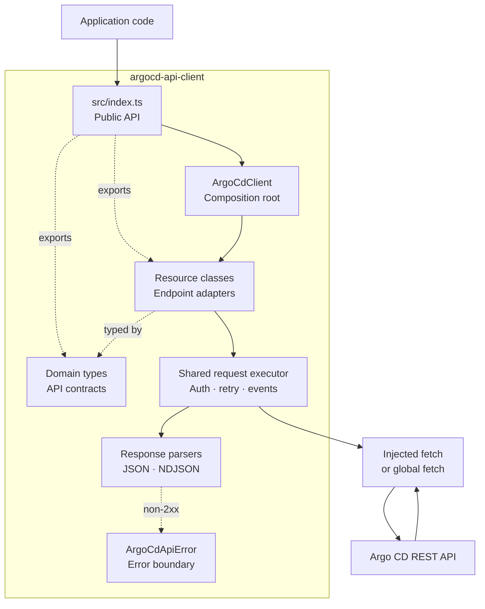

# Architecture

This document describes the runtime structure, boundaries, and data flow of `argocd-api-client`.

## System overview

`argocd-api-client` is a dependency-free TypeScript client for the Argo CD REST API. Consumers use
one `ArgoCdClient` instance and access API services through resource properties such as
`applications`, `projects`, and `repositories`. The transport is fetch-compatible and defaults to the
runtime's global `fetch`, so it works in Node.js 18+ and modern browsers.

The package is published from one public entry point in both ESM (`dist/index.js`) and CommonJS
(`dist/index.cjs`) formats, with TypeScript declarations in `dist/index.d.ts`.

## Layers and responsibilities

| Layer | Location | Responsibility |
| --- | --- | --- |
| Public API | `src/index.ts` | Exports the client, resource classes, error class, and public TypeScript types. |
| Core | `src/ArgoCdClient.ts` | Owns configuration, authentication state, request execution, response parsing, retry behavior, and request events. |
| Endpoint adapters | `src/resources/` | Map typed methods to Argo CD HTTP paths, query parameters, bodies, and response types. |
| API contracts | `src/domain/` | Define TypeScript interfaces for Argo CD requests, responses, and Kubernetes-derived data. |
| Error boundary | `src/errors/ArgoCdApiError.ts` | Represents non-2xx API responses with HTTP status and status text. |

### Public API

`src/index.ts` is the only build entry point. It exports `ArgoCdClient`, `ArgoCdApiError`, all 11
resource classes, client/event types, domain types, and query parameter types. Adding an export here
changes the package's public API and generated declaration surface.

### Core client

`ArgoCdClient` is the composition root and transport owner. Its constructor normalizes the base URL,
stores an optional token, creates method-specific request functions, and injects those functions into
resource instances. Resources therefore know endpoint semantics but do not own authentication,
networking, response parsing, or observability.

The client exposes these resource properties:

| Property | Resource class | Argo CD area |
| --- | --- | --- |
| `applications` | `ApplicationResource` | Applications and their Kubernetes resources |
| `applicationSets` | `ApplicationSetResource` | ApplicationSets |
| `projects` | `ProjectResource` | Projects |
| `repositories` | `RepositoryResource` | Git/Helm repositories |
| `repoCreds` | `RepoCredsResource` | Repository credential templates |
| `clusters` | `ClusterResource` | Managed clusters |
| `accounts` | `AccountResource` | Accounts, permissions, and tokens |
| `certificates` | `CertificateResource` | Repository TLS and SSH certificates |
| `gpgKeys` | `GpgKeyResource` | GPG verification keys |
| `settings` | `SettingsResource` | Read-only server settings |
| `version` | `VersionResource` | Server version information |

Most resource methods only construct paths and parameters, then delegate to an injected request
function. `ApplicationResource` also contains convenience projections such as application health,
images, pods, containers, nodes, and diffs.

### Domain contracts and errors

Files in `src/domain/` group interfaces by API area. These types describe wire data but do not perform
runtime validation. API compatibility therefore depends on Argo CD returning shapes compatible with
the declared types.

For non-2xx responses, the parser throws `ArgoCdApiError`. The error contains `status`, `statusText`,
parsed response `body`, request `url`, HTTP `method`, and a request ID when the server supplies one.
Network, abort, JSON parsing, and listener errors propagate as their original errors.

## Request lifecycle

Resource methods select one of four parser/request configurations over one shared transport executor:

- `request`: GET requests with optional query parameters and JSON responses.
- `bodyRequest`: POST, PUT, or PATCH requests with a JSON body and JSON response.
- `emptyRequest`: DELETE requests without a request body; successful responses are still parsed as
  JSON.
- `ndJsonRequest`: GET requests whose newline-delimited JSON response is converted to an array.
- `ndJsonStreamRequest`: lazy GET requests exposing newline-delimited JSON as an `AsyncIterable`.

A logical request follows this sequence:

1. Build the URL. GET/NDJSON requests use `URL` and `URLSearchParams`; array query values become
   repeated keys. Body and DELETE requests concatenate the normalized base URL and resource path.
2. Create headers. `Accept: application/json` is always sent; body requests also send
   `Content-Type: application/json`. An available token adds `Authorization: Bearer <token>`.
3. Call the injected fetch-compatible transport, or global `fetch` by default, with the caller's
   optional `AbortSignal`.
4. If the response is `401` and stored username/password credentials exist, refresh the session token
   and retry once. Token-only clients do not retry.
5. Parse the response. JSON pipelines call `response.json()` after checking `response.ok`. NDJSON
   pipelines decode incrementally and preserve lines across chunk boundaries. `logs()` collects
   successful values into an array; `logsStream()` yields them as they arrive. A text fallback supports
   responses without a readable body.
6. Emit one `request` event for the logical operation. The event records URL, method, timestamps,
   duration, final status when available, and any thrown error.
7. Return the typed value or rethrow the error.

`AbortSignal` is passed to the initial fetch, credential refresh, and retry. Aborting rejects the
operation and produces a failed request event.

Streaming requests are lazy. Their request event is emitted when iteration completes, fails, aborts,
or closes early; early closure cancels the response reader.

### Authentication ownership

There are two authentication modes:

- `new ArgoCdClient({ baseUrl, token })` stores only the supplied token. The caller owns token renewal.
- `ArgoCdClient.fromCredentials(...)` exchanges username/password for a token, then stores both the
  token and credentials. This enables automatic refresh after a `401` and explicit `refreshSession()`.

Concurrent refresh attempts share one in-flight promise, preventing duplicate session exchanges.

Credentials and tokens are private in-memory state. `deleteSession()` invalidates the session on the
server but does not clear the token or stored credentials in the client instance. `setToken()`
replaces local token state, while `clearSession()` removes both token and credentials. A session
generation counter prevents an older in-flight refresh from overwriting either explicit change.
